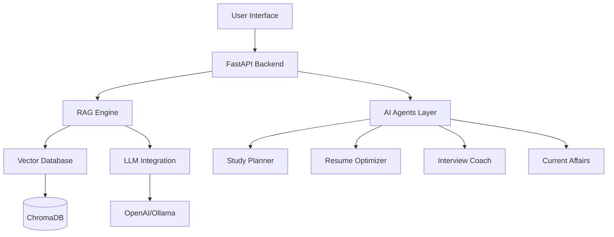

<div align="center">

# 🚀 ResumeRAG

### AI-Powered Career Intelligence Platform

[](https://www.python.org/downloads/)
[](https://opensource.org/licenses/MIT)
[](CONTRIBUTING.md)
[](https://github.com/MEKALA-JASWANTH/ResumeRAG/stargazers)

**ResumeRAG** is an intelligent RAG-based system specifically designed for competitive exam preparation & job search. Built with LangChain, FastAPI, and modern AI models.

[Features](#-features) • [Quick Start](#-quick-start) • [Demo](#-demo) • [Documentation](#-documentation) • [Contributing](#-contributing)

</div>

---

## 🎯 Why ResumeRAG?

> **Problem**: Millions of students preparing for competitive exams (SSC CGL, UPSC, GATE) and software jobs struggle with:
> - Information overload from multiple study materials
> - Lack of personalized learning paths
> - Inefficient resume optimization for job applications
> - No structured interview preparation

**ResumeRAG solves this** by combining RAG (Retrieval-Augmented Generation) with AI agents to create a personalized career intelligence platform.

## ✨ Features

### 🧠 Core RAG Engine
- **Multi-Source Document Intelligence**: Upload PDFs, DOCX, previous year papers, study materials
- **Semantic Search**: Vector-based search across all your documents
- **Context-Aware Q&A**: Ask questions and get answers with source citations
- **Support for Multiple Formats**: Text, PDFs, YouTube transcripts, web articles

### 🤖 AI Agents

#### 📚 Study Planner Agent
- Analyzes your weak areas from mock test performance
- Creates personalized study schedules
- Balances govt exam prep + coding practice
- Recommends specific topics and resources

#### 💼 Resume Optimizer Agent
- Analyzes resume vs job descriptions
- Identifies skill gaps and suggests improvements
- Generates tailored cover letters using RAG
- ATS score optimization

#### 🎤 Interview Coach Agent
- Conducts AI-powered mock interviews
- Real-time feedback on technical answers
- Simulates both technical rounds and SSC interview patterns
- Question-answer evaluation with improvement suggestions

#### 📰 Current Affairs Agent
- Auto-syncs with news sources for GK/Current Affairs
- Creates daily quizzes based on recent events
- Critical for government exam preparation
- Customizable topics and difficulty levels

### 📊 Analytics Dashboard
- Progress tracking and performance visualization
- Weak area identification with heatmaps
- Study time analysis
- Exam readiness score

## 🏗️ Architecture



## 🚀 Quick Start

### Prerequisites
- Python 3.10+
- Docker & Docker Compose (optional)
- OpenAI API key or Ollama (for local LLM)

### Installation

```bash
# Clone the repository
git clone https://github.com/MEKALA-JASWANTH/ResumeRAG.git
cd ResumeRAG

# Create virtual environment
python -m venv venv
source venv/bin/activate  # On Windows: venv\Scripts\activate

# Install dependencies
pip install -r requirements.txt

# Set up environment variables
cp .env.example .env
# Edit .env and add your API keys

# Run database migrations
python scripts/init_db.py

# Start the backend
cd backend
uvicorn main:app --reload

# In another terminal, start the frontend
cd frontend
npm install
npm run dev
```

### Using Docker

```bash
# Build and run with Docker Compose
docker-compose up --build

# Access the application
# Frontend: http://localhost:3000
# Backend API: http://localhost:8000
# API Docs: http://localhost:8000/docs
```

## 📖 Documentation

- [Installation Guide](docs/SETUP.md)
- [API Documentation](docs/API.md)
- [Architecture Overview](docs/ARCHITECTURE.md)
- [Contributing Guidelines](CONTRIBUTING.md)
- [Example Use Cases](examples/README.md)

## 💡 Usage Examples

### 1. Chat with Your Study Materials

```python
from resumerag import RAGEngine

# Initialize RAG engine
rag = RAGEngine()

# Upload documents
rag.upload_documents([
    "ssc_cgl_2023_paper.pdf",
    "polity_notes.pdf",
    "python_interview_questions.pdf"
])

# Ask questions
response = rag.query(
    "What are the key polity topics asked in SSC CGL 2023?"
)
print(response.answer)  # With source citations
```

### 2. Get Personalized Study Plan

```python
from resumerag.agents import StudyPlannerAgent

# Initialize agent
planner = StudyPlannerAgent()

# Create study plan
plan = planner.create_plan(
    target_exam="SSC CGL 2025",
    weak_areas=["Reasoning", "Quantitative Aptitude"],
    available_hours_per_day=4,
    exam_date="2025-07-15"
)

print(plan.schedule)  # Daily study schedule
print(plan.resources)  # Recommended resources
```

### 3. Optimize Your Resume

```python
from resumerag.agents import ResumeOptimizerAgent

# Initialize agent
optimizer = ResumeOptimizerAgent()

# Analyze resume
analysis = optimizer.analyze(
    resume_path="my_resume.pdf",
    job_description="Software Engineer - Python, FastAPI, ML"
)

print(analysis.ats_score)  # ATS compatibility score
print(analysis.suggestions)  # Improvement suggestions
print(analysis.missing_skills)  # Skills to add
```

## 🛠️ Tech Stack

### Backend
- **Framework**: FastAPI (Python 3.10+)
- **RAG Orchestration**: LangChain
- **Vector Database**: ChromaDB / Weaviate
- **LLM**: OpenAI GPT-4 / Ollama (local)
- **Embeddings**: sentence-transformers
- **NLP**: spaCy
- **Document Parsing**: PyPDF2, python-docx, Docling
- **Database**: PostgreSQL
- **Cache**: Redis

### Frontend
- **Framework**: React.js + TypeScript
- **Styling**: Tailwind CSS
- **Charts**: Recharts
- **State Management**: React Query
- **API Client**: Axios

### DevOps
- **Containerization**: Docker & Docker Compose
- **CI/CD**: GitHub Actions
- **Testing**: pytest, Jest
- **Code Quality**: Black, ESLint, Prettier

## 🗂️ Project Structure

```
ResumeRAG/
├── backend/
│   ├── api/                 # FastAPI routes
│   ├── agents/              # AI agent implementations
│   │   ├── study_planner.py
│   │   ├── resume_optimizer.py
│   │   ├── interview_coach.py
│   │   └── current_affairs.py
│   ├── rag_engine/          # Core RAG implementation
│   │   ├── document_processor.py
│   │   ├── vector_store.py
│   │   ├── retriever.py
│   │   └── generator.py
│   ├── models/              # Database models
│   ├── utils/               # Helper functions
│   └── main.py              # Application entry point
├── frontend/
│   ├── src/
│   │   ├── components/      # React components
│   │   ├── pages/           # Page components
│   │   ├── hooks/           # Custom hooks
│   │   ├── services/        # API services
│   │   └── utils/           # Utility functions
│   └── public/
├── docker/
│   ├── Dockerfile
│   └── docker-compose.yml
├── docs/                    # Documentation
├── tests/                   # Test files
├── examples/                # Usage examples
├── scripts/                 # Utility scripts
├── requirements.txt
├── package.json
├── .env.example
└── README.md
```

## 🎥 Demo

*Coming soon! Demo video and screenshots will be added here.*

## 🤝 Contributing

We welcome contributions! This project is designed to help millions of students and job seekers.

### How to Contribute

1. **Fork the repository**
2. **Create your feature branch**: `git checkout -b feature/AmazingFeature`
3. **Commit your changes**: `git commit -m 'Add some AmazingFeature'`
4. **Push to the branch**: `git push origin feature/AmazingFeature`
5. **Open a Pull Request**

See [CONTRIBUTING.md](CONTRIBUTING.md) for detailed guidelines.

### Contributors

<!-- ALL-CONTRIBUTORS-LIST:START -->
<!-- ALL-CONTRIBUTORS-LIST:END -->

Thanks to all our contributors! ❤️

## 📈 Roadmap

- [x] Core RAG engine with document processing
- [x] Basic UI with chat interface
- [ ] Study Planner Agent (In Progress)
- [ ] Resume Optimizer Agent (In Progress)
- [ ] Interview Coach Agent
- [ ] Current Affairs Agent with news scraping
- [ ] Mobile app (React Native)
- [ ] Chrome extension for quick access
- [ ] Integration with popular job boards (LinkedIn, Naukri)
- [ ] Multi-language support (Hindi, Tamil, Telugu)
- [ ] Offline mode with local LLMs
- [ ] Community features (study groups, discussion forums)

## 📊 Project Stats


## 📄 License

This project is licensed under the MIT License - see the [LICENSE](LICENSE) file for details.

## 💖 Support

If you find this project useful, please consider:

- ⭐ Starring the repository
- 🐛 Reporting bugs
- 💡 Suggesting new features
- 📖 Improving documentation
- 💬 Sharing with others

## 🙏 Acknowledgments

- Inspired by RAGFlow and similar projects
- Built with amazing open-source libraries
- Special thanks to the AI/ML community

## 📞 Contact

**Mekala Jaswanth**
- GitHub: [@MEKALA-JASWANTH](https://github.com/MEKALA-JASWANTH)
- Project Link: [https://github.com/MEKALA-JASWANTH/ResumeRAG](https://github.com/MEKALA-JASWANTH/ResumeRAG)

---

<div align="center">

**Made with ❤️ for students and job seekers**

If this project helped you, consider giving it a ⭐!

</div>
